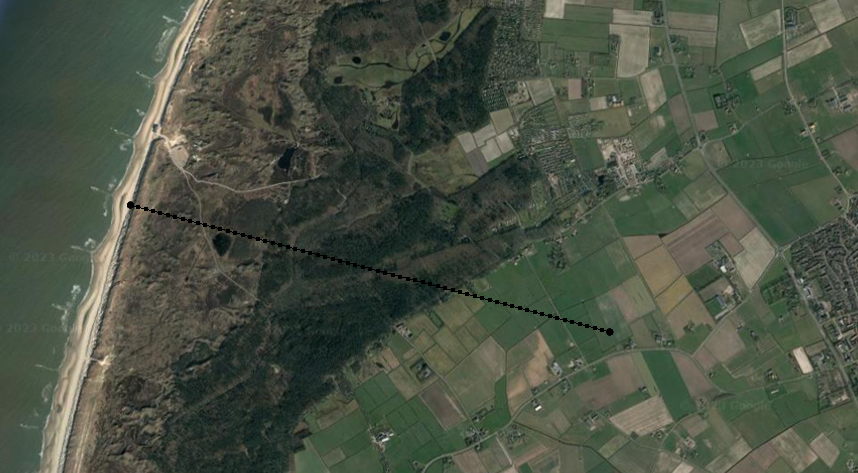

```{r echo=FALSE}
rm(list = ls())
library(FVFE1D)
```

# The location of the cross section

The cross section start at the North Sea side continuing over the dune towards the polders in the direction of the village den Burg. .

The length of the model is about 3 km and the depth extends from the surface till 15m below MSL in depth where one can find a clay deposit of the Drente/Gieten formation and is assumed impermeable. The elevations at the surface are based on AHN.

```{r}
#loading elevation data from AHN

ahn2 = read.csv(file = "Elevation Profile Data_AHN2_W-E.csv",header = TRUE)
domain = 1000*range(ahn2$Distance)
#create a function of this profile because there are way to much point in this data
#the csv file is in this is in km
ahn2.fun = approxfun(1000*ahn2$Distance,ahn2$Elevation)
#a plot of the elevations at every 10 m in the x-direction
plot(rep(1:round(domain[2]/10))*10,ahn2.fun(rep(1:round(domain[2]/10))*10),type = "o",col = 'brown',lwd =2,xlab = "Elevation (m)",ylab = "Distance (m)",main="Elevation of the x-section")
grid()
```

## Domain and nodes of the model

The model extends from west to east for about 3 km. the depth at which the clayey layer limits the groundwater flow is -15m AMSL (NAP in Dutch) The nodal distance applied for the model is for now 50m but can be adjusted later on.

```{r}
nodes = seq(from = domain[1], to = domain[2], by = 50)
flow.domain.x = c(0,max(nodes),rev(nodes))
bot.domain = - 15
flow.domain.y = c(bot.domain,bot.domain,ahn2.fun(rev(nodes)))
plot(flow.domain.x,flow.domain.y, xlab = "Elevation (m)",ylab = "Distance (m)",main="Domain of the model")
polygon(flow.domain.x,flow.domain.y, col = "lightblue", lwd = 2)
grid()
```

# Saturated groundwater flow

Flow here will be based on:

$$
Q = -kD(x)\frac{\partial H}{\partial x}
$$

```{r}
k = 5 #m/d
Darcy = function(x,state,gradstate)
{
  D = state - bot.domain #the saturated thickness of the model at this point
  Q = -k*D*gradstate
  return(Q)
}
```

# Setting up the base stationary model without drainage system

```{r}
precip = 0.001
Tex.stat = newFLOW1D(domain = domain, systemfluxfunction = Darcy, name = "Stationary Texel 1D")
set.BC.fixedstate(Tex.stat,where = "left", value = 0.0) # sea level 
set.BC.fixedstate(Tex.stat,where = "right", value = -0.75)# approximate polder level
add.spatialflux(Tex.stat,rate = "precip",name = "Precipitation")
set.discretisation(Tex.stat,nodes=nodes, method = "FV")
solve.steps(Tex.stat)
plot(Tex.stat,fluxplot = T)
```

# Adding the drainage system to the model

The cross section contains dunes and polders. Only in the polders a drainage sytems (mainly ditches) is present and start 1400 m inland from the North Sea side. The drain depth in the polders is -0.75 m NAP.\
The dune area will have the elevation as "drain depth". This ensures that when storm events occur and water levels rise above the surface this water will be discharged from the model (runoff). The drainage resistance is based on the local drainage system of the polders (Cdrain = 100 days) and the vertical resistance of the soil when there is runoff is 10 days (Crunoff)

```{r}
drain.nodes = nodes[nodes >1400]
dune.nodes = nodes[nodes <= 1400]
drain.depth = ahn2.fun(drain.nodes) - 0.75
dune.depth = ahn2.fun(dune.nodes)
draindepth.fun = approxfun(x=c(dune.nodes,drain.nodes),y=c(dune.depth,drain.depth), rule = 2)

range.drainage.depth = range(draindepth.fun(nodes))
plot(nodes,ahn2.fun(nodes),type="l",lwd =2, col="green",
     ylab= "Elevation (m)",xlab="Distance (m)",ylim = range.drainage.depth,
     main = "Elevations (green) and drain depths (red)"  )
lines(nodes,draindepth.fun(nodes),col = "red",lwd=2, lty = "dashed")
grid()

Cdrain = 100 #estimate based on drainage system at location
Crunoff = 10 #just a guess 
drain.fun = function(x,state)
{
  if(state > draindepth.fun(x))
  { 
    if (x > 1400)
      return((draindepth.fun(x) - state)/Cdrain)
    else
      (return((draindepth.fun(x) - state)/Crunoff))
  }else(return(0))
}

add.spatialflux(Tex.stat,rate = drain.fun, name = "Drainage")

solve.steps(Tex.stat)
plot(Tex.stat,fluxplot = T)
 
dataframe.balance(Tex.stat)
df.ext = dataframe.externalfluxes(Tex.stat)
plot(df.ext$x,abs(df.ext$`S{Drainage}dx`), type = "o",col = "red")
lines(df.ext$x,df.ext$`S{Precipitation}dx`, col = "blue")
grid()
```

## Creating a plot function to see the water table w.r.t. surface elevation

```{r}
plot.wtable = function(mod.name)
{
  df.state = dataframe.states(mod.name)
  plot(flow.domain.x,flow.domain.y, xlab = "Distance (m)",ylab = "Elevation (m)", main = "Water table location (red)")
  polygon(flow.domain.x,flow.domain.y,col = "lightblue",lwd = 2)
  lines(df.state$x,df.state$state, col = "red",lwd =2)
  grid()
}

plot.data.wtable = function(data.states, time.step)
{
    plot(flow.domain.x,flow.domain.y, xlab = "Distance (m)",ylab = "Elevation (m)",
       main = paste("Water table location (red), day :", as.Date(as.character(meteo$yearmonthday[time.step]),"%Y%m%d")))
  polygon(flow.domain.x,flow.domain.y,col = "lightblue",lwd = 2)
  lines(nodes,data.states[time.step,], col = "red",lwd =2)
  grid()

}  

plot.trans.wtable = function(data.states, time.step)
{
  df.state = dataframe.states(data.states)
  plot(flow.domain.x,flow.domain.y, xlab = "Distance (m)",ylab = "Elevation (m)",
       main = paste("Water table location (red), day :", as.Date(as.character(meteo$yearmonthday[time.step]),"%Y%m%d")))
  polygon(flow.domain.x,flow.domain.y,col = "lightblue",lwd = 2)
  lines(df.state, col = "red",lwd =2)
  grid()

}

```

## Adding the evapotranspiration function to the model

With this function the (evapo)transpiration is simulated by using a rooting depth at which the vegetation can extract groundwater from the soil.

### first the root-depth transpiration function

The `root.func` determines the fraction of water extracted by the roots depending on the depth of the groundwater table.

The variable `evaptrns` contains the current Potential Evapotranspiration

```{r}
water.depth = c(0,0.50,1.00,2.00)
frac = c(0,1,1,0)
root.func = approxfun(water.depth,frac, rule = 2)
plot(water.depth,root.func(water.depth), 
     main = "Root transpiration funciton", type = "o", col = "darkgreen",lwd = 3)
grid()

evaptrns = 0.0004
evaptrans.fun = function(x,state)
{
  return(-evaptrns*root.func(ahn2.fun(x) - state))
}


add.spatialflux(model = Tex.stat, rate = evaptrans.fun,name = "Evapotranspiration")

summary(Tex.stat)

```

## Base stationary model containing Precipitation, Drainage and Evapotranspiration

```{r}
##wen heads in the model are corrupted "do.initialize" makes them better to start simulations with
do.initialize(Tex.stat,init = 0.0)
solve.steps(Tex.stat)
plot.wtable(Tex.stat)
dataframe.balance(Tex.stat)
```

## some additonal plotting function of the results

```{r}
# plot.external =  function(model.name,...)
# {
#   df.ext = dataframe.externalfluxes(model.name)
#   ext.q = list(...)
#   flux.range = range(df.ext[,2:(length(ext.q)-1)])
#   toparse = paste0("plot(df.ext[,1],df.ext$",ext.q[[1]],", ylim = c(",flux.range[1],",",flux.range[2],"), type = ","\"o\")")
#   eval(parse(text = toparse))
#  first.ext.q = paste0("df.ext$",ext.q[1])
#  plot(df.ext$ext.q[[1]])
#  plot(df.ext$x,(first.ext.q))
#  print(first.ext.q)
# print(df.ext$ext.q[1])
# print(df.ext)
#}
# plot.external = function(model.name)
# {
#   df.ext = dataframe.externalfluxes(model.name)
#   y.range = range(df.ext[,2:4])
#   plot(nodes,df.ext$Drainage, type = "l",lwd=2, col="blue",ylim = y.range, ylab = "Flux rate mm/d",xlab = "Distance", main = "Flux rates of external fluxes in mm/d")
#   lines(nodes,df.ext$Evapotranspiration, lwd = 2, col="red")
#   lines(nodes,df.ext$Precipitation, lwd = 2, col="green")
#   grid()
#   precip.sum = paste("ppt m2/d: ",as.character(round(sum(df.ext$`S{Precipitation}dx`),digits = 2)))
#   drnage.sum = paste("drn m2/d: ",as.character(round(sum(df.ext$`S{Drainage}dx`),digits = 2)))
#   evptrn.sum = paste("evp m2/d: ",as.character(round(sum(df.ext$`S{Evapotranspiration}dx`),digits = 2)))
#   q.legend = c(precip.sum,drnage.sum,evptrn.sum)
#   legend("bottomleft",q.legend, col= c("green","blue","red"), lwd = 3, horiz = FALSE)
# }
plot.external = function(model.name)
{
  df.ext = dataframe.externalfluxes(model.name)
  y.range = range(df.ext[,2:5])
  plot(nodes,df.ext[,2], type = "l",lwd=2, col="blue",ylim = y.range, ylab = "Flux rate mm/d",xlab = "Distance", main = "Flux rates of external fluxes in mm/d") #drainage
  lines(nodes,df.ext[,3], lwd = 2, col="red")#evapotranspiration
  lines(nodes,df.ext[,5], lwd = 2, col="green")#precipitation
  grid()
  precip.sum = paste("ppt m2/d: ",as.character(round(sum(df.ext[,9]),digits = 2))) #sum precipitation
  drnage.sum = paste("drn m2/d: ",as.character(round(sum(df.ext[,6]),digits = 2))) #sum drainage
  evptrn.sum = paste("evp m2/d: ",as.character(round(sum(df.ext[,3]),digits = 2))) #sum evapotranspiration
  q.legend = c(precip.sum,drnage.sum,evptrn.sum)
  legend("bottomleft",q.legend, col= c("green","blue","red"), lwd = 3, horiz = FALSE)
}

plot.wbudget = function(wb.name)
{
wb.range = range(wb.name[,(2:6)])
plot(wb.name[,1], type = "l",lwd=2, ylim = wb.range, ylab = "flux m2/d", 
     xlab = 'Days (d)', main = paste("water budget of: ",deparse(substitute(wb.name)))) #drn
lines(wb.name[,2], col = "red",lwd=2)#evap
lines(wb.name[,3], col = "green",lwd=2)#stor_in
lines(wb.name[,4], col = "orange",lwd=2)#stor_out
lines(wb.name[,5], col = "blue",lwd=2)#precip
lines(wb.name[,6], col = 'brown',lwd=2)#bnd
grid()
legend("topright", c("drainage","evap","stor2flow","flow2stor","precip","boundary"),
       col=c("black","red","green","orange","blue","brown"),horiz = FALSE, lwd =3)
}

plot.wbudget.veg = function(wb.name)
{
nr.wbs = length(wb.name[1,-1]) #number of water balance terms
nr.colors = rainbow(n = nr.wbs)
wb.range = range(wb.name[,(2:nr.wbs)])
plot(as.Date(as.character(wb.name[,1]), "%Y%m%d"), wb.name[,2],col = nr.colors[1], type = "l",lwd=2, ylim = wb.range, ylab = "flux m2/d", 
     xlab = 'Days (d)', main = paste("water budget of: ",deparse(substitute(wb.name)))) #drn
for (i in 2:nr.wbs)
{
  lines(as.Date(as.character(wb.name[,1]), "%Y%m%d"), wb.name[,i+1], col = nr.colors[i], lwd = 1.5)
}
# lines(wb.name[,2], col = "red",lwd=2)#evap
# lines(wb.name[,3], col = "green",lwd=2)#stor_in
# lines(wb.name[,4], col = "orange",lwd=2)#stor_out
# lines(wb.name[,5], col = "blue",lwd=2)#precip
# lines(wb.name[,6], col = 'brown',lwd=2)#bnd
grid()
legend("topright", names(wb.name[-1]),
       col=nr.colors ,horiz = FALSE, lwd =3)
#legend("topright", c("drainage","evap","stor2flow","flow2stor","precip","boundary"),
#       col=c("black","red","green","orange","blue","brown"),horiz = FALSE, lwd =3)
}
  


yyyymmdd2date = function(meteo.date)
{
  split = strsplit(meteo.date,)
}
# dag = meteo$yearmonthday[3]
# as.Date(as.character(meteo$yearmonthday[730]),"%Y%m%d")

```

## Transient simulations

### Storage formulation and time step

Water is stored into pore pace of soil. There wetter the soil the less water can be stored. In case of a fully saturated node only a very limited amount of water can be stored due to some compressability of the materials.

```{r}
# created an Storage function here to limit storability for shallow water tables
S.max = 0.25
S.min = 0.0001
S.fun = approxfun(x=c(0,2),y=c(S.min,S.max),rule = 2)
plot(rep(0:200)*0.01,S.fun(rep(0:200)*0.01),xlab = "depth gr.w.table",
     ylab = "S", main = "storage coefficient vs. gr.w. table")
grid()
# storage.fun = function(x,state)
# {
#   return(S.fun(ahn2.fun(x)-state)*(old.H.state(x) - state)/delta.t)
# }

storage.fun = function(x,state)
{
  return(S.max*(old.H.state(x) - state)/delta.t)
}
  

# summary(xz_model)
# 
# old.H.state = state.fun(xz_model)
# solve.steps(xz_model)
# dataframe.balance(xz_model)
# plot(xz_model,fill = "state")
# df.external = dataframe.externalfluxes(xz_model)
# plot(xz_model, fill = df.external$`S{Storage}dl`, fill.name = "storage total",
#      fill.contours = c(0,1,2))
# df.states = dataframe.states(xz_model)
# plot(xz_model, fill = df.states$y - df.states$state, fill.contours = c(0,0),
#      fill.name = "water table")
# 


```

### The transient model

Since we are going to simulate the processes in time, the stationary model `Tex.stat` need to be set to a transient model, introducing dynamics through the storage formulation.

```{r}
#copy the stationary model to Tex.trans
Tex.trans = copy.model(Tex.stat)
# get the previous state as the initial states for the transient model
old.H.state = state.fun(Tex.stat)
# save these initial states (heads) for practical purpusis
init.H.state = old.H.state 
# add the storage to the niew transient model
add.spatialflux(model = Tex.trans, rate = storage.fun, name = "Storage")
# see if all is set all right
summary(Tex.trans)

```

### The time loop

### KNMI data

```{r}
meteo = read.csv(file = "meteo_texel.csv")
names(meteo) = c("station_code","yearmonthday","RH","EV24")
#as.character.Date(meteo$Column2)
meteo$RH = meteo$RH/10000
meteo$RH[which(meteo$RH < 0)] = 0.0 #to filter the -1 values out of the KNMI data
meteo$EV24 = meteo$EV24/10000
plot(meteo$RH,type = "l")
lines(meteo$EV24,col = "red")

precip_surplus = meteo$RH - meteo$EV24
plot(precip_surplus,type = "l", main = "Precipitation surplus", xlab = "days" ,ylab = "mm/d")
abline(h = 0.0, lwd = 3, col= "blue")
grid()

```

For each time step a new precipitation value (`meteo$RH` ) will be loaded in the `precip` variable as also with the evapotranspiration value (`meteo$EV24` ) which will be loaded into the `evaptrns` .

### Selection of locations to track results

The basic setup runs the model for the required time based on the begin.time and end.time. Available KNMI data comes from the meteorological station of Texel the time series for precipitation and evapotranspiration extends from March 31, 2010 till March 30, 2023. The drainage, evaporation, preciptition and storage changed for the whole model will be stored. In addition the time series of the location of the groundwater table will be stored as well. To gain more insight in the water budgets for specific location one can create set of node to store water budget data. Below the node numbers of the model

```{r}
plot(Tex.stat, addnodenumbers = T)
```

One could for example track water budget data for the polder area with node numbers: 11 - 20 And or parts of the dune area: 47 - 54 Simply use the function: `df.dune = dataframe.balance(xz_model, region= c(47,48,49,50,51,52,53,54))` in case of the dune area. Now add this line to the script below **before** code line `old.H.state = state.fun(xz_model)`

### Transient model run

```{r fig.height= 10}

begin.date = 20100331 #March 31 2010
end.date  =  20100430 #365 #length(meteo$yearmonthday)
begin.day.nr = which(meteo$yearmonthday == begin.date)
end.day.nr = which(meteo$yearmonthday == end.date)
current.day = begin.day.nr
delta.t = 1.0 #day
do.initialize(model = Tex.trans, init = init.H.state)
start.run = Sys.time()
#some data containers
wb = c()
w.table = c()
heads = c()
wb.dune = c()
wb.polder = c()
df.drn = c()
df.evp = c()
df.sto = c()

while (current.day < end.day.nr)
{
  current.day = current.day + delta.t
  precip = meteo$RH[current.day]
  evaptrns = meteo$EV24[current.day]
  
   control = solve.steps(Tex.trans)#,verboselevel = 1)
# some stuff to store.
   wb.df = dataframe.balance(Tex.trans)
   wb = rbind(wb, c(meteo$yearmonthday[current.day],wb.df[2,3],wb.df[3,3],wb.df[4,2],wb.df[4,3],wb.df[5,2],wb.df[6,3]))
   df.state = dataframe.states(Tex.trans)
   w.table = rbind(w.table, df.state$state)
   #dune water balance
   df.dune = dataframe.balance(Tex.trans, region= c(1:28))
   wb.dune = rbind(wb.dune, c(meteo$yearmonthday[current.day],df.dune[2,3],df.dune[3,3],df.dune[4,2],df.dune[4,3],df.dune[5,2],df.dune[6,3]))
   #dune water balance
   #polder water balance
   df.polder = dataframe.balance(Tex.trans, region = c(29:62))
   wb.polder = rbind(wb.polder, c(meteo$yearmonthday[current.day],df.polder[2,3],df.polder[3,3],df.polder[4,2],df.polder[4,3],df.polder[5,2],df.polder[6,3]))
   #polder data balance
   #external fluxes per node per time step, addign date to the dataframe
   df.ext = dataframe.externalfluxes(Tex.trans)
   df.drn = rbind(df.drn, c(meteo$yearmonthday[current.day],df.ext$Drainage))
   df.evp = rbind(df.evp, c(meteo$yearmonthday[current.day],df.ext$Evapotranspiration))
   df.sto = rbind(df.sto, c(meteo$yearmonthday[current.day],df.ext$Storage))
   #external fluxes per node per time step
   old.H.state = state.fun(Tex.trans)
   print(cat(current.day,wb.df[2,3],wb.df[3,3],wb.df[4,2],wb.df[4,3],wb.df[5,2],wb.df[6,3]))
#  B$Bcurrent = delta.t*(B$WUE*watred.func(dataframe.states(Texelmod)$state)*evaptrns - B$alpha*B$Bcurrent) +B$Bcurrent
# plot(Texelmod,fill = B$Bcurrent, ) 
  # plot(Tex.trans, 
  #      fill = dataframe.states(Tex.trans)$y - dataframe.states(Tex.trans)$state,
  #      fill.contours = c(0,0), fill.name = "water table")
}
end.run = Sys.time()
end.run - start.run

wb = data.frame(wb)
names(wb) = c("Date","drn","evap","stor_in","stor_out","precip","bnd")
wb.dune = data.frame(wb.dune)
names(wb.dune) = c("Date","drn","evap","stor_in","stor_out","precip","bnd")
wb.polder = data.frame(wb.polder)
names(wb.polder) = c("Date","drn","evap","stor_in","stor_out","precip","bnd")
df.ext = dataframe.externalfluxes(Tex.trans)

# wb.range = range(wb[,(1:5)])
# plot(wb$drn, type = "o", ylim = wb.range)
# lines(wb$evap, col = "red")
# lines(wb$stor_in, col = "green")
# lines(wb$stor_out, col = "orange")
# lines(wb$precip, col = "blue")
# grid()
# legend("topright", c("drainage","evap","stor_in","stor_out","precip"),
#        col=c("black","red","green","orange","blue"),horiz = FALSE, lwd =3)
# 
plot.wbudget(wb)
plot.wbudget(wb.dune)
plot.wbudget(wb.polder)
```

Lets create an animation of the data

```{r animation.hook='gifski', fig.height= 10,interval=0.25}

# for (i in (begin.time+1) : (end.time-1))
# {
#   #################################plotting#########################################
#   old.par=par(no.readonly=TRUE)
#   layout(matrix(c(1,2,3,4),ncol=1,byrow=T))
#   #first plot meteo data
#   plot(rep(begin.time:end.time),meteo$RH[begin.time:end.time],col='blue',type='l')
#   lines(rep(begin.time:end.time),meteo$EV24[begin.time:end.time],col= 'red')
#   abline(v=i)
#   grid()
#   #second plot water budget data
#   plot.wbudget(wb)
#   abline(v=i)
#   grid()
#   #third plot distribution of external fluxes in the model
#   plot.external(Tex.trans)
#   #fourth plot water table
#   plot.data.wtable(w.table,time.step = i - begin.time)
#   #reset plot parameters
#   par(old.par)
#   #reset plot parameters
#   #################################plotting#########################################
# }
```

Trying something with plotly

```{r}
library(plotly)
fig1 = plot_ly(df.ext, x = ~x, y = ~Evapotranspiration, type = "scatter",mode = "lines")
fig1 = add_lines(fig1, x = ~x, y = ~Drainage, type = "scatter",mode = "lines")
fig1 = add_lines(fig1, x = ~x, y = ~Precipitation, type = "scatter",mode = "lines")
fig1 = add_lines(fig1, x = ~x, y = ~Storage, type = "scatter",mode = "lines")
fig1

dune.budget = plot_ly(wb.dune,x = ~as.Date(as.character(wb.dune$Date),"%Y%m%d"), y = ~evap, type = "scatter",mode = "lines", name = "evap")
dune.budget = add_lines(dune.budget, x = ~as.Date(as.character(wb.dune$Date),"%Y%m%d"), y = ~drn, type = "scatter", mode = "lines", name = "drainage")
dune.budget = add_lines(dune.budget, x = ~as.Date(as.character(wb.dune$Date),"%Y%m%d"), y = ~stor_in, type = "scatter", mode = "lines", name = "sto2flow")
dune.budget = add_lines(dune.budget,x = ~as.Date(as.character(wb.dune$Date),"%Y%m%d"), y = ~stor_out, type = "scatter", mode = "lines", name = "flow2sto")
dune.budget = add_lines(dune.budget, x = ~as.Date(as.character(wb.dune$Date),"%Y%m%d"),y = ~precip, type = "scatter", mode = "lines", name = "precip")
dune.budget = add_lines(dune.budget, x = ~as.Date(as.character(wb.dune$Date),"%Y%m%d"),y = ~bnd, type = "scatter", mode = "lines", name = "boundary")
dune.budget

fig.wb = plot_ly(wb, x = ~as.Date(as.character(wb$Date),"%Y%m%d"), y = ~drn, type = "scatter", mode = "lines")
fig = add_lines(fig.wb,x = ~as.Date(as.character(wb$Date),"%Y%m%d"), y = ~sto2flow, type = "scatter", mode = "lines")
fig.wb = add_lines(fig.wb,x = ~as.Date(as.character(wb$Date),"%Y%m%d"), y = ~flow2sto, type = "scatter", mode = "lines")
fig.wb = add_lines(fig.wb,x = ~as.Date(as.character(wb$Date),"%Y%m%d"), y = ~veg1, type = "scatter", mode = "lines")
fig.wb = add_lines(fig.wb,x = ~as.Date(as.character(wb$Date),"%Y%m%d"), y = ~veg2, type = "scatter", mode = "lines")
fig.wb = add_lines(fig.wb,x = ~as.Date(as.character(wb$Date),"%Y%m%d"), y = ~veg3, type = "scatter", mode = "lines")
fig.wb = add_lines(fig.wb,x = ~as.Date(as.character(wb$Date),"%Y%m%d"), y = ~veg4, type = "scatter", mode = "lines")
fig.wb = add_lines(fig.wb,x = ~as.Date(as.character(wb$Date),"%Y%m%d"), y = ~veg5, type = "scatter", mode = "lines")
fig.wb = add_lines(fig.wb,x = ~as.Date(as.character(wb$Date),"%Y%m%d"), y = ~veg6, type = "scatter", mode = "lines")
fig.wb = add_lines(fig.wb,x = ~as.Date(as.character(wb$Date),"%Y%m%d"), y = ~soil, type = "scatter", mode = "lines")
fig.wb = add_lines(fig.wb,x = ~as.Date(as.character(wb$Date),"%Y%m%d"), y = ~bnd, type = "scatter", mode = "lines")
fig.wb = add_lines(fig.wb,x = ~as.Date(as.character(wb$Date),"%Y%m%d"), y = ~precip, type = "scatter", mode = "lines")
fig.wb

# fig2 = plot_ly()
# for (i in 1:10)
# {
#   fig2 = add_lines(fig2,x = nodes, y = df.evp[i,], type = "scatter", mode = "lines")
# }
# fig2

evp.dframe = data.frame(df.evp[,-1])
#fig3 = plot_ly(evp.dframe, x = t(nodes), y= t(evp.dframe[,1:62]), frame = evp.dframe[,1], type = "scatter", mode = "lines")
fig3 = plot_ly(evp.dframe, x = nodes, y =~evp.dframe[,1:62], type = "scatter", mode = "lines")
fig3

#make a data.frame forom df.evp


```

# Vegetation development

Based on the current depth of the water table competition between different vegetation types and bare soil will develop a new partitioning pattern.

## Procedure for simulating partitioning

Each time step given the previous depth of the water table the actual transpiration $Ta_i$ of the vegetation and actual evaporation $Ea$ of bare soil can be determined. These will be passed to the groundwater model to calculate new heads for the next time step.\
Based on the actual transpiration and evaporation a new partitioning can be determined

### Application

1.  Setup functions for the vegetation and bare soil fractions; $f_i(x)$

2.  Create new spatial fluxes for the 1D groundwater model

3.  Spatial flux for every vegetation type

    1.  calculate potential transpiration based on current $ET_p(t)$ and vegetation fraction $f_i(x)$

        1.  `Calc.Tpi = function(ETp,fi)`

    2.  calculate $\frac{Ta_i}{Tp_i}$ for this vegetation type

        1.  `Calc.Tai.Tpi = function(Tpi,z,ai,zi)` which returns the fraction (between 0 and 1) $\frac{Ta_i}{Tp_i}$

    3.  return $Ta_i$ to the model as a spatial Cauchy type boundary condition

        1.  `calc.Tai.f1 = function(x,state)` for vegetation type 1

        2.  `add.spatialflux(Tex.veg,rate = calc.Tai.f1, name = "vegetation1")`

4.  Spatial flux for bare soil

    1.  calculate potential evaporation based on $Ep=ET_p - \sum_{i=1}^{n} Tp_i$

    2.  calculate $Ea = \frac{Ep}{1+(\frac{z}{z_E})^{a_E}}$

        1.  `calc.Ea.f0 = function(x,state)`

    3.  return $Ea$ to the model as a spatial Cauchy type boundary condition

        1.  `add.spatialflux(Tex.veg, rate = calc.Ea.f0, name = "soil")`

5.  Run the model with the current vegetation types and bare soil flux

6.  Calculate $( \frac{\Delta f_i}{\Delta t})^{(t+\Delta t)}= (\frac{Ta_i}{Tp_i})^{t+\Delta t}f_i^tf_0^t-d_if_i^t$ for all fractions

    1.  retrieve back $Ta_i$ with `df.ext = dataframe.externalfluxes()`

    2.  calculate $Tp_i(x)$ with current $ET_p(t)$ and vegetation fraction $f_i(x)$

    3.  now one calculate back $\frac{\Delta f_i}{\Delta t}(x)^{(t+\Delta t)}$

7.  Calculate the new vegetation fractions

    1.  $f_i(x)^{t+\Delta t} = f_i(x)^t + \frac{\Delta f_i}{\Delta t}(x)^{(t+\Delta t)}$

8.  Calculate new bare soil fractions

    1.  $f0(x)^{t+\Delta t}=f0(x)^t-\sum_{i=1}^n \frac{\Delta f_i}{{\Delta t}(x)^{(t+\Delta t)}}$

9.  Run the model for the next time step, step 5

$$
f_i :\text{vegetation type (-)}\\
z_i : \text{typical water table depth (m)}\\
a_i : \text{typical shape paramter per veg.type}
$$

```{r}
#vegetation f1
f1.ai = 1.39
f1.zi = 250
f1.di = 0.05
f1 = 0.7
f1.start = f1
#vegetation f2
f2.ai = 1.87
f2.zi = 500
f2.di = 0.01
f2 = 0.02
f2.start = f2
#vegetation f3
f3.ai = 2.59
f3.zi = 690
f3.di = 0.05
f3 = 0.02
f3.start = f3
#vegetation f4
f4.ai = 3.27
f4.zi = 1000
f4.di = 0.05
f4 = 0.015
f4.start = f4
#vegetation f5
f5.ai = 2.59
f5.zi = 920
f5.di = 0.05
f5 = 0.02
f5.start = f5
#vegetation f6
f6.ai = 4.5
f6.zi = 1210
f6.di = 0.05
f6 = 0.01
f6.start = f6
#soil evaporation
f0.aE = 1.58
f0.zE = 5.0
f0 = 0.215
f0.start = f0

Calc.Tpi = function(ETp,fi)
{
  #the Etp should be in mm/d
#  return(1000*ETp * fi)
  #GV 31-8-23 ETp is toch al in mm/d
  #return((1000 * ETp + 0.00001) * fi)
  return((ETp + 0.0000001) * fi)
}

# Calc.Tai.Tpi = function(Tpi,z,ai,zi)
# {
#   if (Tpi > 0.0)
#   {
#     bi = 4*ai^2/(ai^2-1)*((ai-1)/(ai+1))^(1/ai)
#     Tai.Tpi = bi* (z/zi)^(ai-1)/(1+(z/zi)^ai)^2
#    # cat(paste("bi: ",bi," Tai : ", Tai), "\n")
#     return(Tai.Tpi)
#     #in the report it states Tai/Tpi = bi* (z/zi)^(ai-1)/(1+(z/zi)^ai)^2
#   }else(return(0))
# }

Calc.Tai.Tpi = function(z,ai,zi)
{
    bi = 4*ai^2/(ai^2-1)*((ai-1)/(ai+1))^(1/ai)
    Tai.Tpi = bi* (z/zi)^(ai-1)/(1+(z/zi)^ai)^2
return(Tai.Tpi)  
}


Calc.dfi.dt = function(Tai.Tpi,fi.old,f0.old,di)
{
  dfi.dt = Tai.Tpi * fi.old * f0.old - di * fi.old
  return(dfi.dt)
}

#set up spatial function for vegetation and bare soil partitioning
f1 = seq(f1.start,f1.start,length = length(nodes))
f1.fun = approxfun(nodes,f1)

f2 = seq(f2.start,f2.start,length = length(nodes))
f2.fun = approxfun(nodes,f2)

f3 = seq(f3.start,f3.start,length = length(nodes))
f3.fun = approxfun(nodes,f3)

f4 = seq(f4.start,f4.start,length = length(nodes))
f4.fun = approxfun(nodes,f4)

f5 = seq(f5.start,f5.start,length = length(nodes))
f5.fun = approxfun(nodes,f5)

f6 = seq(f6.start,f6.start, length = length(nodes))
f6.fun = approxfun(nodes,f6)

f0 = seq(f0.start,f0.start,length = length(nodes))
f0.fun = approxfun(nodes,f0)

Ea.f0 = seq(0,0, length = length(nodes))
Ea.f0.fun = approxfun(nodes, Ea.f0)

calc.Tai.f1 = function(x,state)
{
  f1 = f1.fun(x) 
  Tpi.f1 <<- Calc.Tpi(evaptrns,f1) 
 # Tai.Tpi.f1 = Calc.Tai.Tpi(Tpi.f1,max(0,(ahn2.fun(x)-state))*1000,f1.ai,f1.zi)
   Tai.Tpi.f1 = Calc.Tai.Tpi(max(0,(ahn2.fun(x)-state))*1000,f1.ai,f1.zi)
  Tai.f1 = Tai.Tpi.f1 * evaptrns * f1
  return(-Tai.f1)
}


calc.Tai.f2 = function(x,state)
{
  f2 = f2.fun(x)
  Tpi.f2 <<- Calc.Tpi(evaptrns,f2) 
  
  #Tai.Tpi.f2 = Calc.Tai.Tpi(Tpi.f2,max(0,(ahn2.fun(x)-state))*1000,f2.ai,f2.zi)
  Tai.Tpi.f2 = Calc.Tai.Tpi(max(0,(ahn2.fun(x)-state))*1000,f2.ai,f2.zi)
  Tai.f2 = Tai.Tpi.f2 * evaptrns * f2
  return(-Tai.f2)
}

calc.Tai.f3 = function(x,state)
{
  f3 = f3.fun(x)
  Tpi.f3  <<- Calc.Tpi(evaptrns,f3)
  #Tai.Tpi.f3 = Calc.Tai.Tpi(Tpi.f3,max(0,(ahn2.fun(x)-state))*1000,f3.ai,f3.zi)
  Tai.Tpi.f3 = Calc.Tai.Tpi(max(0,(ahn2.fun(x)-state))*1000,f3.ai,f3.zi)
  Tai.f3 = Tai.Tpi.f3 * evaptrns * f3
  return(-Tai.f3)
}

calc.Tai.f4 = function(x,state)
{
  f4 = f4.fun(x)
  Tpi.f4  <<- Calc.Tpi(evaptrns,f4) 
 #  Tai.Tpi.f4 = Calc.Tai.Tpi(Tpi.f4,max(0,(ahn2.fun(x)-state))*1000,f4.ai,f4.zi)
  Tai.Tpi.f4 = Calc.Tai.Tpi(max(0,(ahn2.fun(x)-state))*1000,f4.ai,f4.zi)
  Tai.f4 = Tai.Tpi.f4 * evaptrns * f4
  return(-Tai.f4)
}

calc.Tai.f5 = function(x,state)
{
  f5 = f5.fun(x)
  Tpi.f5 <<-  Calc.Tpi(evaptrns,f5) 
  #  Tai.Tpi.f5 = Calc.Tai.Tpi(Tpi.f5,max(0,(ahn2.fun(x)-state))*1000,f5.ai,f5.zi)
  Tai.Tpi.f5 = Calc.Tai.Tpi(max(0,(ahn2.fun(x)-state))*1000,f5.ai,f5.zi)
  Tai.f5 = Tai.Tpi.f5 * evaptrns * f5
  return(-Tai.f5)
}


calc.Tai.f6 = function(x,state)
{
  f6 = f6.fun(x)
  Tpi.f6 <<- Calc.Tpi(evaptrns,f6)
  #  Tai.Tpi.f6 = Calc.Tai.Tpi(Tpi.f6,max(0,(ahn2.fun(x)-state))*1000,f6.ai,f6.zi)
  Tai.Tpi.f6 = Calc.Tai.Tpi(max(0,(ahn2.fun(x)-state))*1000,f6.ai,f6.zi)
  Tai.f6 = Tai.Tpi.f6 * evaptrns * f6
  return(-Tai.f6)
}

calc.Ea.f0 = function(x,state)
{
  #Ep = ETp - sum(Tpi.fi)
  Ep = evaptrns - (Tpi.f1 + Tpi.f2 + Tpi.f3 + Tpi.f4 + Tpi.f5 + Tpi.f6)
    Ea =  Ep/(1+max(0,(ahn2.fun(x)-state))*1000/f0.zE)^f0.aE
  return(-Ea)
}

Tex.veg = copy.model(Tex.trans)
rem.spatialflux(Tex.veg,"Evapotranspiration")
add.spatialflux(Tex.veg,rate = calc.Tai.f1, name = "vegetation1")
add.spatialflux(Tex.veg,rate = calc.Tai.f2, name = "vegetation2")
add.spatialflux(Tex.veg,rate = calc.Tai.f3, name = "vegetation3")
add.spatialflux(Tex.veg,rate = calc.Tai.f4, name = "vegetation4")
add.spatialflux(Tex.veg,rate = calc.Tai.f5, name = "vegetation5")
add.spatialflux(Tex.veg,rate = calc.Tai.f6, name = "vegetation6")
add.spatialflux(Tex.veg, rate = calc.Ea.f0, name = "soil")


begin.date = 20100331 #March 31 2010
end.date  =  20140330 #365 #length(meteo$yearmonthday)
begin.day.nr = which(meteo$yearmonthday == begin.date)
end.day.nr = which(meteo$yearmonthday == end.date)
current.day = begin.day.nr
delta.t = 1.0 #day
do.initialize(model = Tex.veg, init = init.H.state)

#a container to track water balance terms for the whole model
wb = c()
#log file in case the model doesn't converge
error.log = c()

#create a matrix alike set for the partitioning
f0.frac = c()
f1.frac = c()
f2.frac = c()
f3.frac = c()
f4.frac = c()
f5.frac = c()
f6.frac = c()

#create individual vectors for the partitions for use with plotly or other stuff
f0.set = c()
f1.set = c()
f2.set = c()
f3.set = c()
f4.set = c()
f5.set = c()
f6.set = c()
date.set = c()
nodes.set = c()
wtable.set = c()

#just to keep track of cpu time
start.run = Sys.time()
while (current.day < end.day.nr)
{
  current.day = current.day + delta.t
  precip = meteo$RH[current.day]
  evaptrns = meteo$EV24[current.day]
  #run the model with the current fluxes
  solve.steps(Tex.veg)
  cat(paste("day :",as.Date(as.character(meteo$yearmonthday[current.day]), "%Y%m%d"),
            "ppt: ",meteo$RH[current.day], "evpot: ",meteo$EV24[current.day],'\n'))

    #saving some intermediate water balance data in wb.df
   wb.df = dataframe.balance(Tex.veg)
   ##names(wb) = c("Date","drn","sto2flow","flow2sto","veg1","veg2","veg3","veg4","veg5","veg6","soil","precip","bnd")
   wb = rbind(wb, c(meteo$yearmonthday[current.day],wb.df[2,3],wb.df[3,2],wb.df[3,3],wb.df[4,3],
                    wb.df[5,3],wb.df[6,3],wb.df[7,3],wb.df[8,3],wb.df[9,3],wb.df[10,3],wb.df[11,2],wb.df[12,4]))

  #save current data; Tai, Ea
  df.external = dataframe.externalfluxes(Tex.veg)
  #save current state
  df.states = dataframe.states(Tex.veg)
  #calculate the water table depth w.r.t. surface
  wtable = ahn2.fun(nodes)-df.states$state
    #replace the water tables which are above surface
  wtable[which(wtable <0)]=0
  #create a function from the water table data to be used in e.g. calc.Ea.fo, calc.Tai.f2
  wtable.fun = approxfun(nodes,wtable)
  wtable.set = c(wtable.set,wtable) #saving the water table data for some (Gt??) analysis
  #set up values to calculate the new fractions
  #fractions vegetation 1
  #Tpi.f1 = Calc.Tpi(-evaptrns,f1.fun(nodes))
  Tai.f1 = df.external$vegetation1
  TaiTpi.f1 = Calc.Tai.Tpi(wtable.fun(nodes),f1.ai,f1.zi)
  df1.dt = Calc.dfi.dt(TaiTpi.f1,f1,f0,f1.di)
  f1 = f1.fun(nodes) + df1.dt
  f1.fun = approxfun(nodes,f1)
  f1.frac = rbind(f1.frac,f1)
  f1.set = c(f1.set,f1)
  #fractions vegetation 2
  #Tpi.f2 = Calc.Tpi(-evaptrns,f2.fun(nodes))
  Tai.f2 = df.external$vegetation2
  TaiTpi.f2 = Calc.Tai.Tpi(wtable.fun(nodes),f2.ai,f2.zi)
  df2.dt = Calc.dfi.dt(TaiTpi.f2,f2,f0,f2.di)
  f2 = f2.fun(nodes) + df2.dt
  f2.fun = approxfun(nodes,f2)
  f2.frac = rbind(f2.frac,f2)
  f2.set = c(f2.set,f2)
  #fractions vegetation 3
  #Tpi.f3 = Calc.Tpi(-evaptrns,f3.fun(nodes))
  Tai.f3 = df.external$vegetation3
  TaiTpi.f3 = Calc.Tai.Tpi(wtable.fun(nodes),f3.ai,f3.zi)
  df3.dt = Calc.dfi.dt(TaiTpi.f3,f3,f0,f3.di)
  f3 = f3.fun(nodes) + df3.dt
  f3.fun = approxfun(nodes,f3)
  f3.frac = rbind(f3.frac,f3)
  f3.set = c(f3.set,f3)
  #fractions vegetation 4
  #Tpi.f4 = Calc.Tpi(-evaptrns,f4.fun(nodes))
  Tai.f4 = df.external$vegetation4
  TaiTpi.f4 = Calc.Tai.Tpi(wtable.fun(nodes),f4.ai,f4.zi)
  df4.dt = Calc.dfi.dt(TaiTpi.f4,f4,f0,f4.di)
  f4 = f4.fun(nodes) + df4.dt
  f4.fun = approxfun(nodes,f4)
  f4.frac = rbind(f4.frac,f4)
  f4.set = c(f4.set,f4)
  #fractions vegetation 5
  #Tpi.f5 = Calc.Tpi(-evaptrns,f5.fun(nodes))
  Tai.f5 = df.external$vegetation5
  TaiTpi.f5 = Calc.Tai.Tpi(wtable.fun(nodes),f5.ai,f5.zi)
  df5.dt = Calc.dfi.dt(TaiTpi.f5,f5,f0,f5.di)
  f5 = f5.fun(nodes) + df5.dt
  f5.fun = approxfun(nodes,f5)
  f5.frac = rbind(f5.frac,f5)
  f5.set = c(f5.set,f5)
 #fractions vegetation 6
  #Tpi.f6 = Calc.Tpi(-evaptrns,f6.fun(nodes))
  Tai.f6 = df.external$vegetation6
  TaiTpi.f6 = Calc.Tai.Tpi(wtable.fun(nodes),f6.ai,f6.zi)
  df6.dt = Calc.dfi.dt(TaiTpi.f6,f6,f0,f6.di)
  f6 = f6.fun(nodes) + df6.dt
  f6.fun = approxfun(nodes,f6)
  f6.frac = rbind(f6.frac,f6)
  f6.set = c(f6.set,f6)
  #fractions bare soil
  f0 = f0 - df1.dt - df2.dt - df3.dt - df4.dt - df5.dt - df6.dt
  f0.fun = approxfun(nodes,f0)
  f0.frac = rbind(f0.frac,f0)
  f0.set = c(f0.set,f0)
#  date.set = c(date.set,rep(as.Date(as.character(meteo$yearmonthday[current.day]),"%Y%m%d"),times = length(nodes)))# issues with plot_ly not accepting "2012-11-31"  for sliders/animations
  date.set = c(date.set,rep(meteo$yearmonthday[current.day],times = length(nodes)))
  nodes.set = c(nodes.set,nodes)
#  plot.wtable(Tex.veg)
  old.H.state = state.fun(Tex.veg)
}
stop.run = Sys.time()
stop.run - start.run
#creating a data frame for the water balance data
wb = data.frame(wb)
#names(wb) = c("Date","drn","sto2flow","flow2sto","veg1","veg2","soil","precip","bnd")
names(wb) = c("Date","drn","sto2flow","flow2sto","veg1","veg2","veg3","veg4","veg5","veg6","soil","precip","bnd")
```

### See how plotly works with this:

```{r}
#first create a dataframe with the available data

df.results = data.frame(date.set,nodes.set,f0.set,f1.set,f2.set,f3.set,f4.set,f5.set,f6.set,wtable.set)
colnames(df.results) = c("Date","Location","F0","F1","F2","F3","F4","F5","F6","wtable")

save(df.results,file = "results.dat")

#some basic plots:

 kleur = rgb(red = 0,green = 0,blue = 1, alpha = 0.1)
plot(nodes.set, f4.set, pch = 21, col = kleur, bg = kleur)

boxplot(f0.set~nodes.set)
boxplot(f1.set~nodes.set)
boxplot(f2.set~nodes.set)
boxplot(f3.set~nodes.set)
boxplot(f4.set~nodes.set)
boxplot(f5.set~nodes.set)
boxplot(f6.set~nodes.set)

plot(nodes.set,wtable.set, pch = 21, col = kleur, bg = kleur)
boxplot(wtable.set~nodes.set)

#see how the water table changes in time
nrdays = end.day.nr - begin.day.nr
wspiegel = matrix(wtable.set,ncol = nrdays, byrow = F)
plot(wspiegel[2,])
```

### Have a look at the data

```{r}
plot.frac.day = function(nrday)
{
  plot(nodes,f0.frac[nrday,], type = "o", col = "brown",
       lwd=2, ylim = c(0,1), main = paste("fractions of daynr : ",nrday))
  lines(nodes,f1.frac[nrday,], col = "green", lwd = 2)
  lines(nodes,f2.frac[nrday,], col = "blue", lwd = 2)
  grid()
}

plot.frac.loc = function(location)
{
  plot(f0.frac[,location], type = "o", col = "brown",
       lwd=2, ylim = c(0,1), main = paste("fractions location : ",location))
  lines(f1.frac[,location], col = "green", lwd = 2)
  lines(f2.frac[,location], col = "blue", lwd = 2)
  grid()
}
  
for (i in 1: (length(f0.frac[,1])-1))
{
  plot.frac.day(i)
}


##just to have a close look at the data

save.image(file = "results.Rdata")


```
